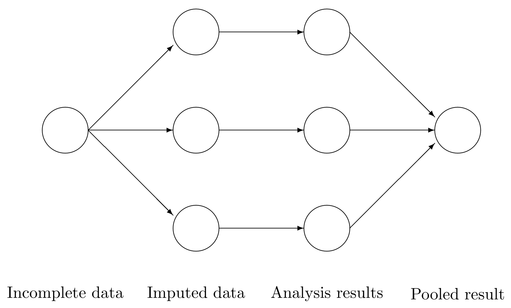

## Mice
{fig-align="center"}

## Calculating the total variance MICE

From @fimd

<center>
$$T = \bar{U} + B + \frac{B}{m} \\ = \bar{U} + \left(1 + \frac{1}{m}\right) B$$

</center>

## Example

```{r}
#| label: example-code
#| echo: true
#| eval: false

library(mice)

df <- nhanes

#default
imp <- mice(nhanes, print = F)
imp

# Variable selection
pred <- quickpred(nhanes)

imp2 <- mice(nhanes, pred = pred, print = F)
imp2
```

## Results


```{r}
#| label: example-code-active
#| echo: false
#| eval: true
#| cache: true

library(mice)

df <- nhanes

#default
imp <- mice(nhanes, print = F)


# Variable selection
pred <- quickpred(nhanes)

imp2 <- mice(nhanes, pred = pred, print = F)

```


:::: {.columns}

::: {.column width="45%"}

Default method

```{r}
#| label: default
#| echo: false
library(mice)

imp
```


:::

::: {.column width="10%"}

:::

::: {.column width="45%"}

Using quickpred to perform variable selection

```{r}
#| label: quickpred
#| echo: false

imp2
```
:::

::::

## Checks

```{r}
#| label: plotsss-prep
#| echo: false

comp <- mice::complete(imp2, "long")

```


```{r}
#| label: fig-one
#| echo: false
#| fig-cap: "Caption"


library(plotly)
library(ggplot2)


p <- ggplot(comp, aes(x = chl, y = bmi, color = comp$.imp)) + 
      geom_point() +
      stat_smooth(method = "lm", col = "red")

ggplotly(p)

```
## Table

```{r}
#| label: prep-table
#| echo: false

library(DT)
library(tibble)
library(gtsummary)

nhanest <- as.tibble(df)

```
```{r}
#| label: tbl-overview
#| tbl-cap: "Hope this works"
#| echo: false


nhanest |> 
  datatable( options = list(pagelength = 10))

```


## References

